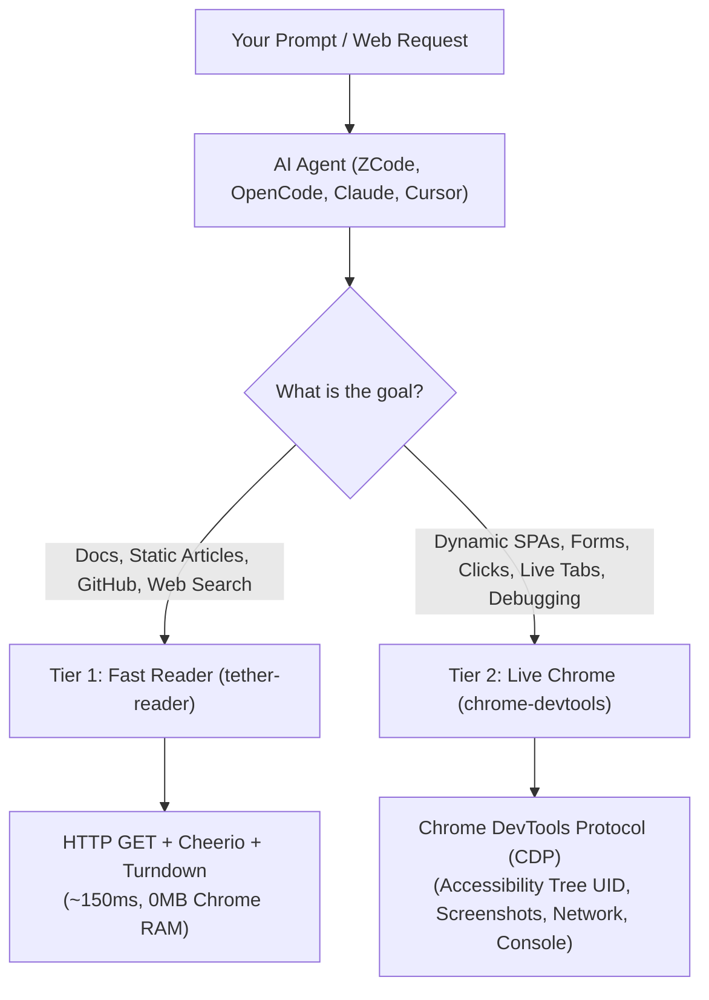

# 🌐 ChromeTether

> **Dual-tier web browsing & live Chrome automation toolkit for AI coding assistants and autonomous agents via Model Context Protocol (MCP).**

[](LICENSE)
[](https://nodejs.org)
[](https://modelcontextprotocol.io)

**ChromeTether** equips your AI agents (ZCode, OpenCode, Claude Code, Claude Desktop, Cursor, Windsurf, Cline) with a dual-tier web browsing system:
1. **Tier 1 (Fast Reader)**: Instant HTTP fetching and Markdown conversion (~150ms, 0MB RAM) for static docs, blogs, and search without starting a browser.
2. **Tier 2 (Live Chrome Attachment)**: Direct Chrome DevTools Protocol (CDP) control attaching to your **currently open Google Chrome tabs** via `--auto-connect`. No unwanted blank windows, no session loss, and full preservation of your logged-in accounts.

---

## 🌟 Architecture & Core Features



### 1. Dual-Tier Workflow

| Tier | Tools | Underlying Engine | Best Used For |
| :--- | :--- | :--- | :--- |
| **Tier 1: Fast Reader** | `read_url_content`, `search_web` | Lightweight HTTP GET + Cheerio + Turndown + DuckDuckGo | Reading documentation, API specs, blogs, GitHub issues/READMEs, and organic search. Runs in **~150ms** with **zero browser overhead**. |
| **Tier 2: Live Chrome** | `chrome-devtools` (`navigate_page`, `click`, `fill`, `take_snapshot`, `take_screenshot`, `list_console_messages`, `list_network_requests`) | Official Google Chrome DevTools Protocol via `chrome-devtools-mcp` | Dynamic SPAs (React, Next.js, Vue), web apps, filling forms, submitting data, inspecting UI, diagnosing console errors, and capturing screenshots. |

### 2. Live Chrome Attachment (`--auto-connect`)
Unlike other tools that spawn isolated, blank browser profiles every time, ChromeTether defaults to `--auto-connect`:
* Attaches directly to your **active, currently running Google Chrome window**.
* Works with your **already logged-in accounts** (GitHub, AWS, Jira, internal dashboards).
* Inspects and automates the exact tabs you have in front of you.

### 3. Token-Efficient Interaction (`uid`)
* Avoids context-window blowouts caused by dumping raw HTML.
* Uses Chrome's **Accessibility Tree** where every interactive button, input, and link is assigned a numeric `uid` (e.g. `[uid: 10] button "Submit"`).
* The AI interacts with 100% precision: `fill(14, "value")` and `click(10)`.

---

## 🚀 1-Click Installation

### Option 1: PowerShell Script (Windows)
Clone the repository and run:

```powershell
git clone https://github.com/toannguyen3107/chrometether.git
cd chrometether
npm install
.\scripts\setup.ps1
```

### Option 2: CLI Command (Cross-Platform)

```bash
git clone https://github.com/toannguyen3107/chrometether.git
cd chrometether
npm install

# Check status of detected agent environments
node bin/chrometether.js status

# Automatically configure all detected agents
node bin/chrometether.js install all

# Or install for a specific agent
node bin/chrometether.js install zcode
node bin/chrometether.js install opencode
node bin/chrometether.js install claude-code
node bin/chrometether.js install claude-desktop
node bin/chrometether.js install cursor
node bin/chrometether.js install windsurf
node bin/chrometether.js install cline
```

---

## ⚙️ Enabling Remote Debugging in Google Chrome (One-Time Setup)

To allow ChromeTether to safely attach to your running Chrome tabs, enable remote debugging:

### Method A (Recommended)
1. Open Google Chrome.
2. Navigate to: `chrome://inspect/#remote-debugging`
3. Check the box: **"Enable remote debugging"** (or "Discover network targets").

### Method B (Command Line / Shortcut)
Launch Chrome with the remote debugging flag:
```bash
chrome.exe --remote-debugging-port=9222
```

---

## 🤖 Supported Agent Integrations

| Agent | Config File | Features Added |
| :--- | :--- | :--- |
| **ZCode (Z.ai)** | `~/.zcode/cli/config.json` | Registers `chrome-devtools` & `tether-reader`. Installs `/browser` slash command in `~/.zcode/commands/` and official browser skills in `~/.zcode/skills/`. |
| **OpenCode CLI** | `~/.config/opencode/opencode.jsonc` | Merged using OpenCode MCP array schema with `--auto-connect`. |
| **Claude Code CLI** | `~/.claude.json` | MCP configuration + installs browser skills in `~/.claude/skills/`. |
| **Claude Desktop** | `claude_desktop_config.json` | MCP configuration with `--auto-connect`. |
| **Cursor IDE** | `~/.cursor/mcp.json` | Cursor MCP server registration. |
| **Windsurf (Codeium)** | `~/.codeium/windsurf/mcp_config.json` | Cascade MCP server registration. |
| **Roo Code / Cline** | `cline_mcp_settings.json` | VS Code extension MCP configuration. |

---

## 🧪 Verification & Diagnostics

Run the comprehensive health check:
```bash
npm test
```
Tests:
* Fast Reader HTML-to-Markdown conversion.
* DuckDuckGo organic search without API keys.
* `tether-reader` Stdio MCP protocol initialization.
* `chrome-devtools` Stdio MCP protocol initialization.

---

## 🔒 Security & Privacy

* **Safe Merging**: The installer creates automatic timestamped `.bak` backups before modifying any configuration file, preserving all your pre-existing MCP servers.
* **No Telemetry / No Cloud Relays**: All MCP communication occurs over local Stdio.
* **No API Keys Required**: Fast web search runs through DuckDuckGo public search without requiring any third-party API tokens.

---

## 📄 License

[MIT License](LICENSE) © 2026 Toan Nguyen
