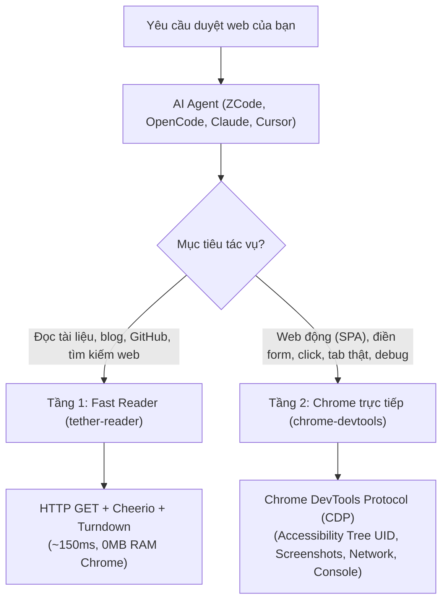

# 🌐 ChromeTether

> **Bộ toolkit duyệt web 2 tầng và điều khiển Chrome trực tiếp cho AI Agent thông qua giao thức MCP (Model Context Protocol).**

[](LICENSE)
[](https://nodejs.org)
[](https://modelcontextprotocol.io)

**ChromeTether** mang đến khả năng duyệt web 2 tầng toàn diện cho các AI coding assistant (ZCode, OpenCode, Claude Code, Claude Desktop, Cursor, Windsurf, Cline):
1. **Tầng 1 (Fast Reader)**: Bóc tách nội dung HTML và chuyển sang Markdown siêu nhanh (~150ms, 0MB RAM) phục vụ đọc tài liệu, blog tĩnh và tìm kiếm thông tin không cần bật trình duyệt.
2. **Tầng 2 (Điều khiển Chrome trực tiếp)**: Kết nối thẳng vào **cửa sổ Google Chrome bạn đang mở** thông qua cờ `--auto-connect` và Chrome DevTools Protocol (CDP). Không mở cửa sổ trình duyệt ảo, giữ nguyên các tab đang mở và toàn bộ phiên đăng nhập của bạn!

---

## 🌟 Kiến trúc & Tính năng cốt lõi



### 1. Kiến trúc 2 tầng tối ưu (Dual-Tier)

| Tầng công cụ | Công cụ | Cơ chế hoạt động | Ưu điểm & Trường hợp sử dụng |
| :--- | :--- | :--- | :--- |
| **Tầng 1: Đọc nhanh (Lightweight)** | `read_url_content`, `search_web` | HTTP GET + Cheerio + Turndown + DuckDuckGo | Đọc tài liệu lập trình, blog, GitHub README, tìm kiếm Google/DuckDuckGo nhanh. Tốn **0MB RAM**, phản hồi chỉ trong **~150ms**. |
| **Tầng 2: Chrome trực tiếp (Live Chrome)** | `chrome-devtools` (`navigate_page`, `click`, `fill`, `take_snapshot`, `take_screenshot`, `list_console_messages`, `list_network_requests`) | Chrome DevTools Protocol chính chủ từ Google | Tương tác Single Page App (React, Next.js, Vue), điền form, click nút, chụp ảnh màn hình, kiểm tra lỗi JavaScript Console & Network API. |

### 2. Bắt sóng Chrome đang mở (`--auto-connect`)
Khác với các công cụ thông thường bật ra một trình duyệt trắng trơn không có cookies:
* Tự động gắn kết (attach) trực tiếp vào cửa sổ Google Chrome bạn đang lướt hàng ngày.
* Tận dụng ngay các tài khoản bạn đã đăng nhập sẵn (GitHub, AWS, Google Cloud, Jira, mạng nội bộ công ty).
* Thao tác trực tiếp trên các tab bạn đang mở trước mắt.

### 3. Tương tác chính xác qua Accessibility Tree `uid`
* Không gây tràn token do nhồi nhét mã HTML thô.
* Dùng cây trợ năng (Accessibility Tree) của Chrome, mỗi phần tử tương tác được đánh số `uid` (ví dụ: `[uid: 10] button "Đăng nhập"`).
* AI tương tác chính xác 100%: `fill(14, "email@example.com")` và `click(10)`.

---

## 🚀 Cài đặt nhanh 1-Click

### Cách 1: PowerShell Script (Windows)
Clone repo về máy và chạy:

```powershell
git clone https://github.com/toannguyen3107/chrometether.git
cd chrometether
npm install
.\scripts\setup.ps1
```

### Cách 2: Lệnh CLI (Đa nền tảng)

```bash
git clone https://github.com/toannguyen3107/chrometether.git
cd chrometether
npm install

# Kiểm tra trạng thái các agent trên máy
node bin/chrometether.js status

# Tự động cấu hình toàn bộ các agent được tìm thấy
node bin/chrometether.js install all

# Hoặc cài riêng cho từng agent cụ thể
node bin/chrometether.js install zcode
node bin/chrometether.js install opencode
node bin/chrometether.js install claude-code
node bin/chrometether.js install claude-desktop
node bin/chrometether.js install cursor
node bin/chrometether.js install windsurf
node bin/chrometether.js install cline
```

---

## ⚙️ Kích hoạt gỡ lỗi trên Google Chrome (Làm 1 lần)

Để ChromeTether có quyền kết nối vào các tab Chrome đang chạy, hãy bật cổng gỡ lỗi:

### Cách 1 (Khuyên dùng)
1. Mở một tab trên Google Chrome đang dùng.
2. Dán địa chỉ sau vào thanh URL: `chrome://inspect/#remote-debugging`
3. Tích chọn ô: **"Enable remote debugging"** (hoặc "Discover network targets").

### Cách 2 (Khởi động kèm cờ lệnh)
Khởi động Chrome kèm cờ:
```bash
chrome.exe --remote-debugging-port=9222
```

---

## 🤖 Các AI Agent được hỗ trợ

| Agent | File cấu hình | Tính năng được tích hợp |
| :--- | :--- | :--- |
| **ZCode (Z.ai)** | `~/.zcode/cli/config.json` | Tự động đăng ký MCP `chrome-devtools` & `tether-reader`. Tích hợp sẵn lệnh `/browser` trong `~/.zcode/commands/` và bộ 5 skills chính thức trong `~/.zcode/skills/`. |
| **OpenCode CLI** | `~/.config/opencode/opencode.jsonc` | Tự động merge theo chuẩn mảng `command` của OpenCode với `--auto-connect`. |
| **Claude Code CLI** | `~/.claude.json` | Cấu hình MCP + tự động sao chép skills vào `~/.claude/skills/`. |
| **Claude Desktop** | `claude_desktop_config.json` | Tự động merge cấu hình stdio MCP. |
| **Cursor IDE** | `~/.cursor/mcp.json` | Cấu hình MCP cho Cursor. |
| **Windsurf (Codeium)** | `~/.codeium/windsurf/mcp_config.json` | Cấu hình MCP cho Cascade. |
| **Roo Code / Cline** | `cline_mcp_settings.json` | Cấu hình MCP cho extension VS Code. |

---

## 🧪 Kiểm tra & Chẩn đoán sức khỏe

Chạy bộ test tích hợp bất cứ lúc nào:
```bash
npm test
```
Bộ test sẽ xác minh:
* Khả năng chuyển đổi HTML sang Markdown của Fast Reader.
* Tìm kiếm DuckDuckGo không cần API key.
* Kết nối JSON-RPC chuẩn MCP của `tether-reader`.
* Khả năng khởi động Stdio MCP của `chrome-devtools`.

---

## 🔒 Bảo mật & An toàn

* **Sao lưu tự động**: Trình cài đặt luôn tạo bản sao lưu `.bak` kèm timestamp trước khi chỉnh sửa file cấu hình của bạn, tuyệt đối không làm mất các server MCP sẵn có (như Burp, DB mcp, v.v.).
* **100% Cục bộ**: Toàn bộ giao tiếp MCP chạy qua kênh Stdio cục bộ, không gửi dữ liệu qua bất kỳ máy chủ trung gian nào.
* **Không yêu cầu API Key**: Tìm kiếm nhanh và bóc tách web hoạt động trực tiếp, không đòi hỏi đăng ký token của bên thứ ba.

---

## 📄 Bản quyền

Phát hành theo giấy phép [MIT License](LICENSE) © 2026 Toan Nguyen.
